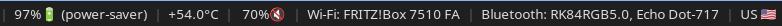

# Minimalist i3 Bar

This repository provides a simple i3blocks-based status bar configuration for the i3 window manager.

The setup focuses on a clean minimalist design using a black bar with white text not distracting the user with bright colors, while still providing a visually pleasing design.

The setup is designed to work with Ubuntu/Debian-based distributions, but should be easily adaptable to other Linux distributions as well by changing the package manager commands in the installation script and ensuring the required dependencies are adapted to the desired Linux distribution.

---

## Overview

The bar looks as follows:




The bar is built using:

- **i3** (window manager)
- **i3blocks** (status bar framework)
- several scripts providing the design and features

Included scripts provide:

- Wi-Fi / network status (`nmcli`) + opening Wifi-manager on click
- Bluetooth connected devices (`bluetoothctl`) + opening Bluetooth manager on click
- Volume control via PipeWire (`wpctl`)
- Battery power display (`powerprofilesctl`) + power profile cycling 
- CPU temperature (`sensors`)
- CPU usage
- Weather display based on user's location + opening the current weather forecast as a website on click
- Current Keyboard layout (country)
- Time and Date Display + opening Google Calendar on click
- Display the currently played song/video title

---

## Installation 
Clone the repository and run the installation script from the cloned directory:

```
bash install.sh
```
The main script is installed into `~/.config/i3/i3blocks-unified.conf` and the individual block scripts are installed into `~/.config/i3blocks-unified/blocks/`.
Upon installation, the user's existing i3 config file is backed up. Then it is modified to comment out any existing bar blocks and add a new bar block for the unified i3blocks configuration.

## Usage
After calling the install script, the bar should appear and is ready to be used. 

The individual scripts are located in `~/.config/i3blocks-unified/blocks/` and can be customized or extended as needed, e.g. if other functionalities for the clicks are desired.

## Deinstallation
For the deinstallation, run 
```
bash ~/.config/i3/i3blocks-unified/uninstall.sh
```
This will restore the original i3 config file from the backup and remove the installed bar configuration and scripts from the user's config directory.

## Dependencies
Dependencies are installed automatically upon calling the installation script.
Debian/Ubuntu packages required:

```txt
curl
jq
network-manager
xdg-utils
wireplumber
x11-xkb-utils
lm-sensors
power-profiles-daemon
bluez
procps
playerctl

# for gui
blueman
gnome-system-monitor
network-manager-gnome

i3blocks
i3-wm
```

Additionally, the bar will look the best, if the user has a font installed that supports the used icons. The default font used in the configuration is `Cascadia Code NF`, but it can be easily changed to any other desired font by changing the `font` variable in the i3blocks configuration file `~/.config/i3/i3blocks-unified.conf`. There, e.g. also accent colors or the bar position can be changed to the user's liking.
